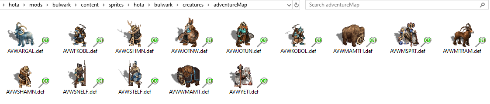
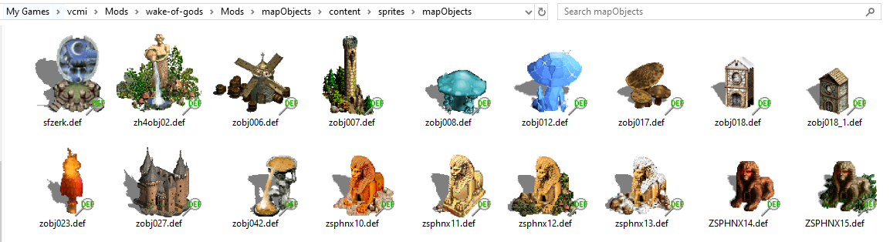

# Heroes III DEF, D32 & P32 Thumbnail Provider

See what is inside Heroes of Might and Magic III `.def`, HotA `.d32`, and HotA
`.p32` files directly in Windows Explorer.

The provider replaces generic file icons with real image previews.
It is useful when browsing, sorting, or editing large collections of Heroes III
graphics because you no longer need to open every file to find the right one.

### Creatures



### Map objects



## Features

- Shows DEF, D32, and P32 graphics as thumbnails in Windows Explorer
- Supports classic Heroes III DEF files and 32-bit HotA D32/P32 files
- Keeps transparent backgrounds on modern Windows
- Works on Windows XP SP3 and newer Windows versions
- Includes x86, x64, and ARM64 builds
- Does not change which application opens `.def`, `.d32`, or `.p32` files

## Download

Download the package for your version of Windows from
[the latest release](../../releases/latest):

- **x64** for most modern PCs  
  [](https://github.com/GeorgeK1ng/DefThumbnailProvider/releases/latest/download/DefThumbnailProvider-x64.zip)
- **x86** for 32-bit Windows and Windows XP  
  [](https://github.com/GeorgeK1ng/DefThumbnailProvider/releases/latest/download/DefThumbnailProvider-x86.zip)
- **ARM64** for Windows on ARM  
  [](https://github.com/GeorgeK1ng/DefThumbnailProvider/releases/latest/download/DefThumbnailProvider-arm64.zip)

Extract the package to a permanent folder. The DLL must stay in that folder
after installation.

## Install

1. Open **Command Prompt as Administrator**.
2. Change to the folder containing `DefThumbnailProvider.dll`.
3. Run:

```bat
regsvr32 /n /i:machine DefThumbnailProvider.dll
```

After the success message, restart Windows Explorer or restart your computer.
Open a folder containing `.def`, `.d32`, or `.p32` files and select
**Large icons** or **Extra large icons**.

If previously cached icons remain, see the
[troubleshooting notes](docs/TECHNICAL.md#install).

## Uninstall

Open **Command Prompt as Administrator** in the installation folder and run:

```bat
regsvr32 /u /n /i:machine DefThumbnailProvider.dll
```

Then restart Windows Explorer or restart your computer.

## About

The DEF decoder is based on code and format knowledge from the
[VCMI project](https://github.com/vcmi/vcmi). D32 and P32 format support was
developed with reference to the GPL-licensed `vcmiextract` project. This
project is distributed under the GNU GPL version 2 compatible terms.

Developers can find build instructions, implementation notes, test tools, COM
details, and licensing information in the
[technical documentation](docs/TECHNICAL.md).
